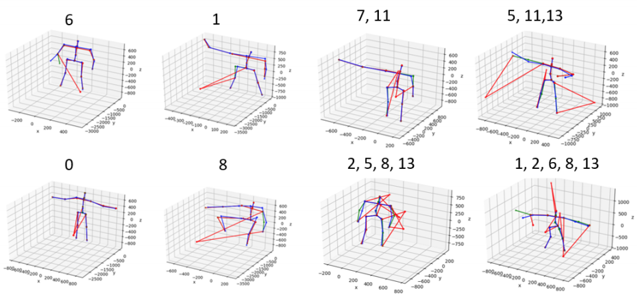

# Unsupervised 3D Human Pose Representation

[[Paper]](https://arxiv.org/abs/2007.07053)

The implementation of our paper *Unsupervised 3D Human Pose Representation with Viewpoint and Pose Disentanglement* (ECCV2020).



To train the pose encoder using corrupted human skeletons, please run
```python
python train_poseAE.py
```

## License and Citation
The use of this software is RESTRICTED to **non-commercial research and educational purposes**.
```
@inproceedings{Unsup3DPose,
  title={Unsupervised 3D Human Pose Representation with Viewpoint and Pose Disentanglement},
  author={Nie, Qiang and Liu, Ziwei and Liu, Yunhui},
  booktitle={European Conference on Computer Vision (ECCV)},
  year={2020}
}
```
